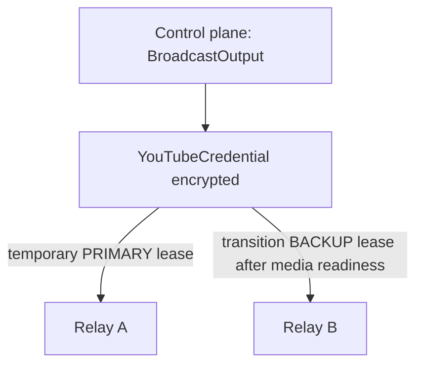

# Credential correction: delta review and implementation

KEEP: BroadcastSession, BroadcastOutput, BroadcastRoute, optional YouTube client/OAuth,
independent multicast publishers, encrypted inter-relay SRT, public secret-free projections,
and compatible existing tests. Initial credential ownership already belonged to the output
binding on the control plane; no permanent per-node YouTube configuration was added.

REFACTOR: migration 10 adds output-wide authority generations and EgressCredentialLease
records. Desired state now separates media preparation from egress assignment. The runtime
checks node/output/slot/generation/expiry and retains the key only in process-owned state
and publisher arguments. Its non-secret disk fence stores generation, issued time and
intent hash. Restart requires a fresh authenticated plan. Revocation drops obsolete runtime
objects; expiry uses a 250 ms watchdog even during a blocked HTTP poll. Python deallocation
is not forensic zeroization. A trusted relay OS administrator can inspect memory/arguments;
do not collect them in crash reports.

AVOID: permanent orchestrated node key files, provisioning every standby, key re-entry on
switch, and treating PRIMARY/BACKUP as separate credentials. Legacy static v1 configuration
and commands remain isolated and unchanged; no automatic node migration.

BroadcastOutput owns YouTubeCredential, represented by the encrypted subentity in its
one-to-one `youtube_bindings` row. Only the control plane holds the canonical copy.
Relays in `managed_egress` mode receive temporary `EgressCredentialLease` assignments,
never legacy permanent `CONFIGURE_YOUTUBE`.

Each assignment-set change increments one monotonic output generation. At most one active
lease per output/slot is allowed by SQLite uniqueness. Renewal is bound to the requesting
node, extends an unexpired lease to 300 seconds, and never revives an expired ID. An old
API intent cannot mint a new lease. Explicit new start may authorize a new generation.
Nodes receive only assigned outputs. Revoked/removed nodes cannot renew. A brief control
outage preserves media until the existing deadline, then the agent stops it. A stopped
slot must not be reused before acknowledged stop or expiry of the old grant. Fencing cannot
erase a key from an unreachable or malicious machine instantly. YouTube does not validate
these leases; this contract is enforced by authenticated, trusted managed agents.

The command equivalent is encrypted desired-state ASSIGN_EGRESS / disabled REVOKE_EGRESS /
safe STATUS_EGRESS heartbeat. Lease rows contain IDs and HMAC fingerprints, never raw keys.
Keys never enter regular status, browser projections, heartbeat requests, audit, lab reports
or managed MediaMTX configuration files. Staging requires restricted runtime directories
or tmpfs, 0600 files and disabled core-dump collection. No deployment was performed.
