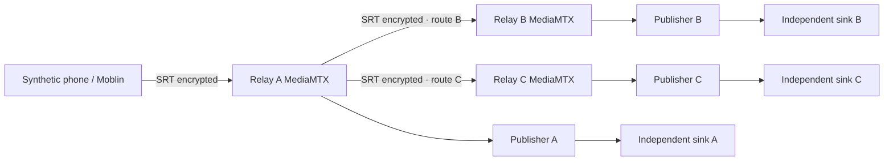

# Inter-relay media plane

The control plane carries intent and telemetry only. An explicitly enabled v2 agent owns
a separate MediaMTX and one FFmpeg copy publisher per output/route. The old v1 agent,
broker, normalizer, source selector and command protocol remain byte-for-byte unchanged.
No bootstrap, firewall rule, host service or agent update is executed by this release.

## Version spike and topology

MediaMTX **1.19.2** is the same version as the existing Compose stack. Its SRT server
supports scoped stream IDs (`read:path:user:pass`) and per-path SRT passphrases; verified
against [streamid.go](https://github.com/bluenviron/mediamtx/blob/v1.19.2/internal/servers/srt/streamid.go)
and [conn.go](https://github.com/bluenviron/mediamtx/blob/v1.19.2/internal/servers/srt/conn.go).
The Windows archive SHA-256 is
`53028b551afcc8d9ddbd56eb8406d5b31e395e5505d52e28347f211696be9345`.
Local FFmpeg **9.0.2**, Gyan essentials build linked by the official FFmpeg downloads page,
has libsrt enabled; archive SHA-256
`60f467265b1e312373dbcd92200c2618a74850f98d3d078e94296bb3fa2047ba`.
This is deliberately distinguished from the Debian bookworm FFmpeg installed in the
project's Python 3.12.11 image. The dedicated CI lab uses that same base and apt FFmpeg
and records its actual version. No claim of production/HK version verification is made.

Relay-local RTSP and RTMP bind only loopback and require credentials. A remote route reads
one dedicated SRT path with a random 256-bit password and encryption passphrase. The path
contains source ID, target route ID and generation; the export permits one reader.
No public internal RTSP is created. MoQ, HLS and WebRTC are disabled on this dedicated
instance (MoQ otherwise opens port 8892 by default in 1.19.2).

## Protocol and secrets

Admin enables a node with a pinned X25519 public key, SRT address/port, explicit resource
limits and media profile. Only then can its existing authenticated node identity use
`/broadcast-agent/v2/heartbeat`. Required capabilities are exactly `multi_output_v1`,
`inter_relay_srt_v1`, `route_switch_v1`, `youtube_dual_ingest_v1`,
`egress_credential_lease_v1`. Legacy nodes continue
their existing endpoint and are rejected for new publishing/switch admission.

The response is an X25519 + HKDF-SHA256 + ChaCha20-Poly1305 envelope over verified HTTPS.
Associated data binds node ID, protocol purpose, generation, issued time and 120-second
expiry. Payloads contain only that node's routes and necessary output credentials.
Envelope encryption is recipient confidentiality/integrity; verified TLS authenticates
the control-plane sender. The agent persists the highest accepted generation and intent
fingerprint and rejects old, expired or conflicting intent after restart.

YouTube and transport credentials use the existing database master-key encryption.
Direct-source passwords are derived separately per node. Forwarding passwords rotate when
a route is stopped and re-enabled. New remote admissions reject expired leases. Established
publishers survive controller outages within their 300-second egress lease. A 250 ms
watchdog stops expired publishers and clears runtime credentials and command arguments.
An expired credential cannot open a new remote connection. Local publisher retries are
bounded to five consecutive failures with exponential backoff, and reset after stable
progress. Inter-relay readers use the same initial backoff, then keep reconnecting once
per minute while their media route remains enabled. This lets a late or returning ingress
recover after the initial five attempts; it does not reset the YouTube publisher budget
or grant any output credentials. Explicit revoke/HTTP 401 or 403 stops the agent. No raw command, URL, node token
or passphrase is logged. MediaMTX and FFmpeg diagnostics can contain secrets, so runtime
discards them and exports only bounded numeric measurements and constant error codes.

The agent CLI is `python -m app.broadcast.agent`. `keygen` writes an encrypted X25519 key
with exclusive creation and prints only its public key. `run` requires an explicit JSON
configuration and the `BROADCAST_LOCAL_MASTER_KEY` and `BROADCAST_NODE_TOKEN` secret
environment values. The node configuration contains IDs, HTTPS control URL, executable
paths, dedicated ports, bind address and runtime directory; no install is automatic.
Keep runtime files on a restricted tmpfs at staged deployment and run as a dedicated
service account. A node's MediaMTX control API remains loopback-only.

## Admission and evidence

Finite limits cover outputs per source, forwarded routes, publishers per node and expected
egress bitrate. Missing opt-in/profile/capabilities or stale heartbeat fails closed.
The publisher uses H.264/AAC copy with separate processes and explicit audio/video maps.
A failed destination cannot block another process or restart the source. SRT bandwidth
is bounded using the expected profile, and the source export has a bounded reader count.

Readiness requires persistent ffprobe readers with advancing video **and** audio PTS,
nonzero packet counts and bitrate, stable source identity and repeated observations.
Separate publisher progress reports are evidence of sending, not viewer playback.
Direct and forwarded paths have different authenticated identities. A direct source is
selected only after three advancing samples; the publisher is then replaced with a
bounded reconnect. There is no promise of a seamless MediaMTX source swap.

The local spike found and fixed a default MoQ listener collision and FFmpeg's RTSP-specific
`timeout` option (SRT uses `rw_timeout`). The FFmpeg 9 SRT library also reports empty control
message warnings against this peer; actual decoding, timestamps and frame identity are
tested rather than inferring success from a socket. See the acceptance evidence for results.

BroadcastOutput owns YouTubeCredential. Relays receive temporary EgressCredentialLease
assignments; see [credential authority and delta review](credential-leases.md).
